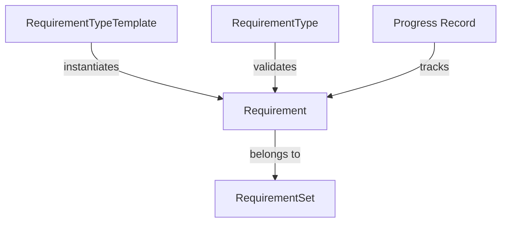

# Certificate Requirements

⚠️ **IMPORTANT**: Requirements should not be edited directly. They should be managed through RequirementSets and RequirementTypeTemplates.

## Quick Setup

To set up a complete working environment:
```bash
# Full setup with fresh data for user 12
drush dhc-setup --reset --uid=12

# Add data without clearing existing
drush dhc-setup --uid=12
```

## Component Setup

Individual components can be set up separately:

```bash
# Generate templates
drush dhc-templates --reset

# Generate requirement sets
drush dhc-gen-req --reset

# Generate standard requirements
drush dhc-gen-std-req --reset
```

## Management Commands

```bash
# List templates
drush dhc-lt

# List enrollments
drush dhc-list-enroll

# Check progress
drush dhc-progress [uid]

# Debug info
drush dhc-debug
```

## Overview

Requirements are structured components that define what students must complete to earn their certificate. They are:
- Created from RequirementTypeTemplates
- Grouped into RequirementSets
- Validated through RequirementTypes

## Requirement Relationships



## Safe Management Methods

1. **Use RequirementSets**
   ```bash
   # Generate standard requirement sets
   drush dhc-gen-std-req
   ```

2. **Use Templates**
   ```bash
   # Create from templates
   drush dhc-gen-ex
   ```

3. **Use Admin Interface**
   - `/admin/config/dh-certificate/requirement-sets`
   - `/admin/config/dh-certificate/requirement-templates`

## Requirement Structure

Requirements are always part of a set:
```yaml
requirement_set:
  id: 'core_requirements'
  label: 'Core Requirements'
  requirements:
    - template: 'core_methods'
      config:
        override: {}
    - template: 'tool_proficiency'
      config:
        override: {}
```

## Validation

Requirements are validated through their associated RequirementType:
```php
$requirement->getType()->validate($requirement, $context);
```

## Best Practices

1. Never modify requirements directly
2. Always use templates for creation
3. Manage through requirement sets
4. Use provided drush commands
5. Follow the admin interface workflows

## Common Mistakes

❌ **Don't**:
- Edit requirement configuration directly
- Create requirements without templates
- Bypass requirement sets
- Modify validation rules directly

✅ **Do**:
- Use requirement sets
- Create from templates
- Follow validation rules
- Use admin interfaces

## See Also

- [Requirement Type Templates](requirement-templates.md)
- [Progress Tracking](progress.md)
- [Drush Commands](drush.md)
